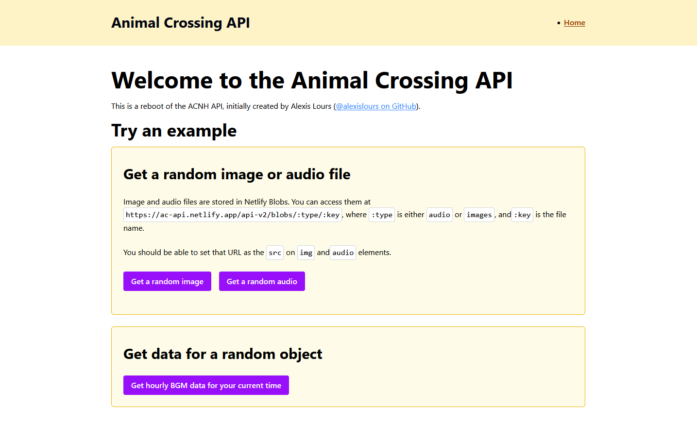
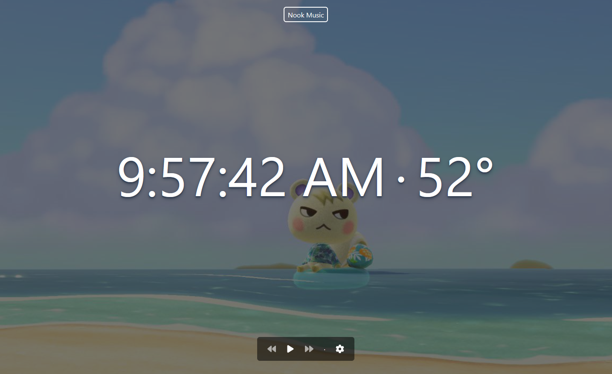

## the challenge

In the process of updating old projects with new learnings, I realized a lot of them were broken because the [original ACNH API](https://web.archive.org/web/20220130072631/http://acnhapi.com/) had gone offline. With no suitable replacement available, I decided to build it myself. I had previous experience putting together an API for about 100 Minute to Win It style games scraped from some websites.

## the approach

For now, I’m replicating the original API one-to-one while using this as an opportunity to explore modern web tooling, including Next.js, Netlify Blobs and Serverless Functions, and Clerk for authentication.

Since this is a personal project done in my spare time, I’d like to establish a consistent pattern for endpoints, and then add them incrementally. I’m starting with the music data since one of my other projects is a music player for the hourly music, same as the in-game experience. An early version of [Nook Music](https://nook-music.netlify.app/) is already consuming this API!

You can read more about implementation details in the [project’s dev log](https://ac-api.netlify.app/devlog).

## the outcome

Currently, the API serves music data, including static audio and image assets, as a proof of concept. This early version demonstrates the framework, endpoint patterns, and workflow for future expansion.

My next steps are to:

- Refactor the admin upload endpoints so they can scale to other games in the series
- Improve security for the admin endpoints
- Update the design to make the interface resemble proper API documentation

