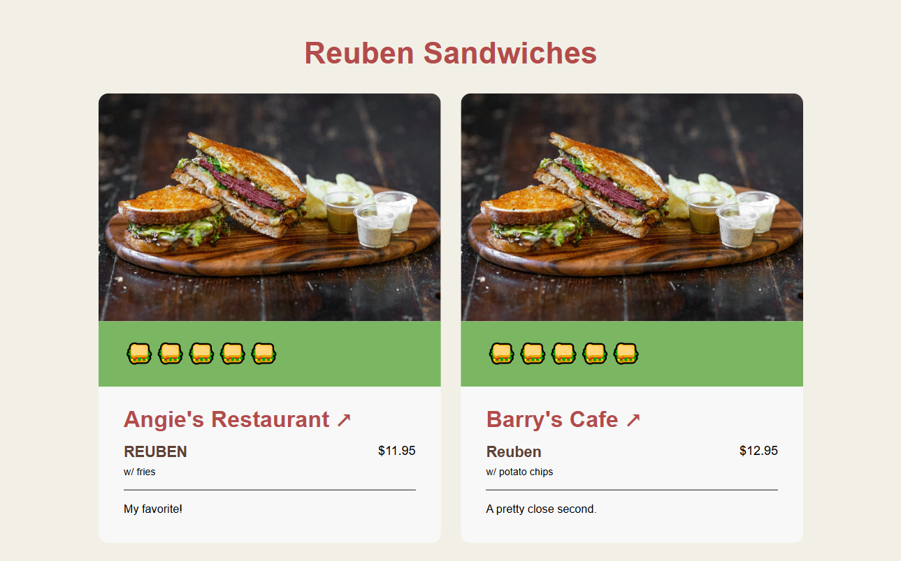

## the challenge

I was inspired by Chris Coyier's [Breakfast Burritos in Bend, Oregon](https://breakfast-burritos.chriscoyier.net/), which I originally discovered in his post on the Frontend Masters Blog, [50 Reasons to Build a Website](https://frontendmasters.com/blog/50-reasons-to-build-a-website/?utm_source=cassidoo&utm_medium=email&utm_campaign=change-your-life-today-dont-gamble-on-the-future).

At work, we’ve been exploring Astro to make our static pages more SEO-friendly, so I decided to experiment with it on my own.

The concept also felt approachable enough to brush up on my Figma skills. Though I trained as a UX Designer, I haven’t had many opportunities since college. So, I wanted to practice creating components and UI mockups, with the ultimate goal of building a design system I could translate from Figma to code (and embrace the designer-developer unicorn 🦄 I always knew I was).

## the approach

### design

I followed a content-first design philosophy, prioritizing clean layouts with minimal visual noise and intentional typography and color choices.

The color palette is inspired by the Reuben itself:

```css
--color-cornedbeef: #b44b4b;
--color-sauerkraut: #efa472;
--color-cabbage: #7bb662;
--color-napkin: #f2f0e6;
--color-bread: #5c4033;
--color-white: #f8f8f8;
--color-black: #2b2b2b;
```


Each color is applied purposefully:

- **Corned beef (red)** for higher tier headings (h1-h2)
- **Bread (brown)** for lower tier headings (h3-h4)
- **Sauerkraut (orange) & Cabbage (green)**: for accents in links or CTAs
- **Black on light neutrals**: for contrast and readablity

Throughout the design process, I kept asking myself questions like:

- What should the user notice first?
- What piece of information is most important? The rating? The restaurant name? The sandwich name?

<div class="grid grid-cols-1 gap-4 md:grid-cols-2">
  <div>
    <p>
      I knew that an image of the sandwiches would be visually effective. I also
      highlighted the rating and restaurant name since the rating is the core of
      this project, and I wanted others to know right away where they could get
      the sandwich.
    </p>
    <p>
      This was achieved with the typography, using large text for both and using
      the primary color for the restaurant name, linking to it in Google Maps
      (because food quality differs by location! Don’t @ me!).
    </p>
  </div>
  <div>
    
  </div>
</div>

### development

Development focused on balancing speed, maintainability, and reliability:

- **TypeScript + Astro**: Typed frontmatter ensures data consistency in each sandwich review.
- **Semantic HTML**: Built proactively with accessibility in mind.
- **Vitest**: Unit tests confirm that each component renders correctly.
- **GitHub Actions (CI/CD)**: Automatically deploys to GitHub Pages when the `main` branch is updated.
- **GitHub Pages**: Provides an easy, static hosting solution integrated with CI/CD.

This workflow ensures code consistency and quality and a streamlined deployment process.

For more implementation details, see the [GitHub repo](https://github.com/geraldiner/reuben-sandwiches?tab=readme-ov-file#reuben-sandwiches).

## the outcome

The result is a [fast, lightweight review site](https://geraldiner.github.io/reuben-sandwiches/) that serves as both a personal showcase and a learning resource.

It demonstrates a modern web development workflow using Astro, from clean code and testing to automated deployment.

My next steps are to:

- Write a tutorial for others to follow. Because the real test of learning is to teach it to someone else!
- Eat every sandwich again and make sure I take a photo _before_ finishing it!


